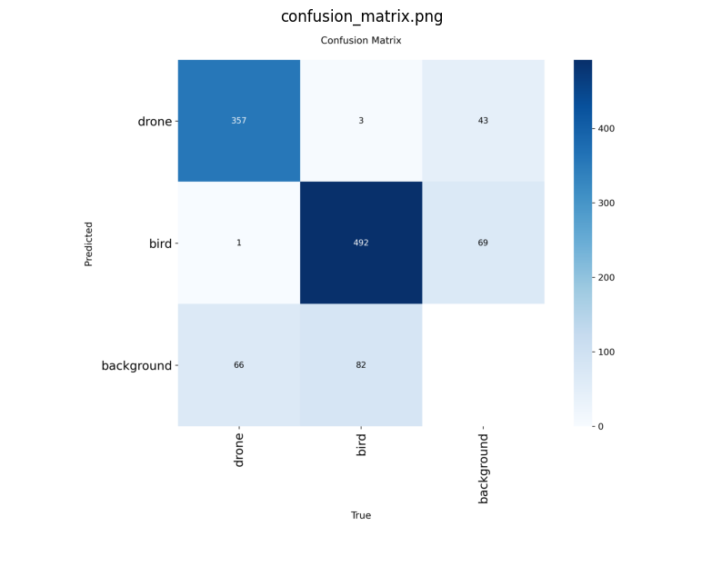
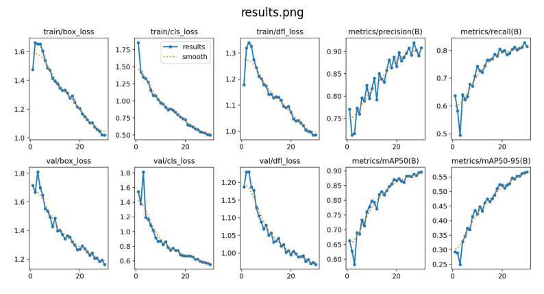

# YOLOv8-Bird-Drone-Detection
YOLOv8 based object detection system for bird and drone classification.

YOLOv8 Tabanlı Kuş ve Drone Tespit Sistemi
Proje Hakkında

Bu proje, kuş ve insansız hava araçlarını (İHA/Drone) birbirinden ayırt edebilen YOLOv8 tabanlı bir nesne tespit sistemi geliştirmek amacıyla hazırlanmıştır.

Model, Google Colab ortamında hazır bird-drone veri seti kullanılarak eğitilmiş ve performansı çeşitli nesne tespit metrikleri ile değerlendirilmiştir.

Kullanılan Teknolojiler
Python
YOLOv8 (Ultralytics)
OpenCV
Google Colab
Veri Seti

Projede kuş ve drone görüntülerinden oluşan hazır bir nesne tespit veri seti kullanılmıştır.

Sınıflar:

Drone (Class ID: 0)
Kuş (Class ID: 1)
Eğitim Parametreleri
Parametre	Değer
Model	YOLOv8s
Maksimum Epoch	50
Görüntü Boyutu	640x640
Batch Size	16
Eğitim Ortamı	Google Colab

Not: Eğitim süreci maksimum 50 epoch olarak başlatılmış, doğrulama performansındaki gelişimin durması nedeniyle YOLOv8'in erken durdurma (Early Stopping) mekanizması tarafından otomatik olarak sonlandırılmıştır.

Model Performansı

Eğitim sonucunda model yaklaşık olarak aşağıdaki performans değerlerine ulaşmıştır:

mAP@0.5 : %89,6
Precision : %90+
Recall : %81+
F1 Score : %86
Sonuçlar
Karışıklık Matrisi (Confusion Matrix)

Eğitim Sonuçları

Proje Yapısı
training/
    train_yolov8_colab.py

inference/
    detect_image_colab.py

results/
    matrix.png
    result.png
    F1_curve.png
    P_curve.png
    PR_curve.png
    R_curve.png
Gelecek Çalışmalar
Gerçek zamanlı video işleme desteği
Çoklu nesne takibi entegrasyonu
Gömülü sistemlerde çalıştırma
Radar ve sensör verileri ile entegrasyon
Küçük hedeflerde tespit başarısının artırılması

Geliştirici

Melike Usta

Bilgisayar Mühendisliği Öğrencisi
